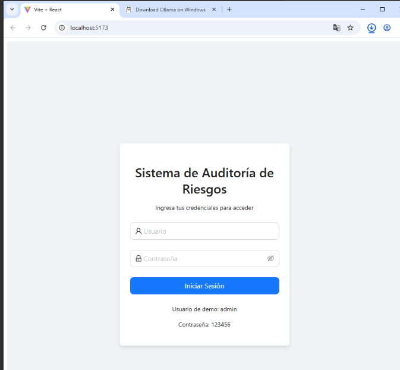
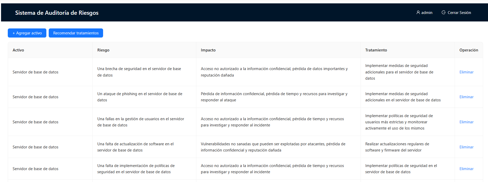

# Informe de Auditoría de Sistemas - Examen de la Unidad I

**Nombres y apellidos: Ximena Andrea Ortiz Fernández**  
**Fecha: 10/09/2025**  
**URL GitHub: https://github.com/ximena-ortiz/ExamenAuditoriaU1**  

---

## Pasos Previos

**Crear el repositorio y subir el codigo**  


**Ejecutar el repositorio base**  

**Configuración del front**  

```bash
cd frontend
npm install
npm run dev
```


**Configuración el back**  

```bash
ollama pull llama2:7b
ollama run llama2:7b
```
**Crear entorno virtual**  

```bash
python -m venv venv
.\venv\Scripts\activate
pip install openai
pip install flask 
```


---

## 1. Proyecto de Auditoría de Riesgos

### Login

**Descripción:**
Se validan las credenciales contra un objeto en memoria (admin/123456). El servicio LoginService.js genera un token simulado y guarda authToken, user y expiresAt en localStorage. 
Además:

- Expiración de sesión: 2 horas (SESSION_MS), controlada con expiresAt.

- Bloqueo de fuerza bruta: tras 3 intentos fallidos se bloquea el login por 30 segundos (MAX_ATTEMPTS y BLOCK_MS).

- isAuthenticated(): verifica existencia de token y vigencia; si expiró, ejecuta logout() y limpia el estado.

- Protección de vistas: en App.jsx se rinde el sistema solo si authenticated === true; en el header se muestra el usuario actual y botón Cerrar sesión.

**Evidencia:**

Captura de la pantalla de login funcionando.


Cambios realizados:

Implementación de expiración de sesión y bloqueo temporal por intentos.


Limpieza automática de sesión expirada en isAuthenticated().


Mensajería de error más clara en la UI y header con usuario + logout.   


---

### Motor de Inteligencia Artificial
**Descripción:**
El motor IA corre localmente con Ollama y se consume desde un backend Flask (app.py) usando el SDK de OpenAI. El sistema expone dos endpoints REST:

- POST /analizar-riesgos

Entrada: { "activo": "<nombre del activo>" }

Salida: {"items":[{"riesgo":"…","impacto":"…"}, …]} (hasta 5 ítems)

Cómo funciona: se envía un prompt que obliga a responder solo JSON válido. El código hace parseo tolerante: intenta json.loads(); si falla, extrae el bloque {…} y reintenta.


- POST /sugerir-tratamiento

Entrada: { "activo": "…", "riesgo": "…", "impacto": "…" }

Salida: una línea corta (<200 caracteres) con el tratamiento alineado a ISO 27001.

Cómo funciona: prompt enfocado para forzar respuestas concisas y prácticas.


**Evidencia:**

Captura de la tabla ya rellenada con 5 riesgos/impactos y la columna Tratamiento completada.


---

## 2. Hallazgos

### Activo 1: *Servidor de Base de Datos*
- **Evidencia:** 

- **Condición:**  
Se identificaron los siguientes riesgos en el servidor de base de datos:  
   1. Brechas de seguridad que permiten accesos no autorizados.  
   2. Ataques de phishing dirigidos al servidor.  
   3. Fallas en la gestión de usuarios que exponen datos sensibles.  
   4. Falta de actualizaciones de software y firmware.  
   5. Ausencia de implementación de políticas de seguridad adecuadas.  

- **Recomendación:**  
   1. Implementar medidas de seguridad adicionales como cifrado y autenticación multifactor.  
   2. Reforzar la protección contra ataques de phishing mediante filtros y capacitación al personal.  
   3. Aplicar políticas de gestión de usuarios más estrictas y monitoreo de accesos.  
   4. Realizar actualizaciones regulares de software y firmware del servidor.  
   5. Implementar políticas de seguridad integrales que abarquen todo el entorno del servidor.  

- **Riesgo:** Probabilidad **Alta**, debido a que las vulnerabilidades detectadas pueden comprometer la confidencialidad, disponibilidad e integridad de la información almacenada.


---

### Activo 2: *Registros de Auditoria*
- **Evidencia:** 

- **Condición:**  
Se detectaron múltiples riesgos en el sistema de gestión de registros:  
   1. Brechas de seguridad que permiten accesos no autorizados a información sensible.  
   2. Fallos en la configuración del firewall que exponen sistemas críticos.  
   3. Envío accidental de información confidencial a destinatarios no autorizados.  
   4. Sistemas de gestión de tareas desactualizados y vulnerables a ataques de phishing.  
   5. Dispositivos móviles mal configurados, expuestos a malware.  

- **Recomendación:**  
   1. Fortalecer la seguridad en la gestión de registros mediante cifrado y controles de acceso.  
   2. Revisar y optimizar la configuración del firewall.  
   3. Implementar políticas de acceso y autorización junto con capacitaciones en seguridad de la información.  
   4. Mantener actualizados los sistemas de gestión y aplicar parches de seguridad.  
   5. Configurar correctamente los dispositivos móviles e implementar soluciones de seguridad móvil (MDM).  

- **Riesgo:** Probabilidad **Alta**, ya que las vulnerabilidades detectadas podrían derivar en accesos no autorizados, pérdida de información sensible y daños a la reputación de la organización.

---

### Activo 3: *Logs de Seguridad*
- **Evidencia:** 

- **Condición:**  
Se detectaron los siguientes riesgos en el sistema de gestión de logs de seguridad:  
   1. Brecha de seguridad en el sistema de logs que podría permitir accesos no autorizados a información confidencial.  
   2. Ataques de phishing a través del sistema de correo electrónico que afectan la confianza de los usuarios.  
   3. Falta de actualización de software en la gestión de logs, lo que permite explotación de vulnerabilidades.  
   4. Errores en la configuración de la red que habilitan tráfico no autorizado.  
   5. Falta de implementación de políticas de seguridad en el área de desarrollo de software.  

- **Recomendación:**  
   1. Implementar medidas de autorización y control de acceso para proteger los logs.  
   2. Realizar análisis de incidentes de seguridad y fortalecer las prácticas de protección frente al phishing.  
   3. Mantener actualizado el software de gestión de logs y revisar periódicamente la seguridad de los registros.  
   4. Corregir configuraciones de red y establecer controles de acceso adecuados.  
   5. Establecer e implementar políticas de seguridad claras en el área de desarrollo de software.  

- **Riesgo:** Probabilidad **Alta**, ya que las vulnerabilidades identificadas comprometen la integridad de los datos, la seguridad de la información y la confianza de los usuarios.

---

### Activo 4: *Servidor Web Apache*
- **Evidencia:** 
 
- **Condición:**  
Se identificaron los siguientes riesgos en el servidor web Apache:  
   1. Ataques de tipo DDoS que pueden dejar el servidor inaccesible.  
   2. Vulnerabilidades de seguridad en el software Apache que permiten explotación por atacantes.  
   3. Falta de actualizaciones de software que lo dejan expuesto a ataques zero-day.  
   4. Configuraciones incorrectas que facilitan ataques de phishing o spam.  
   5. Ausencia de un monitoreo adecuado que retrasa la detección de incidentes.  

- **Recomendación:**  
   1. Implementar medidas de protección contra ataques DDoS (firewall, balanceadores de carga, WAF).  
   2. Mantener Apache actualizado con los últimos parches de seguridad y configuraciones recomendadas.  
   3. Establecer un proceso regular de actualización de software y aplicaciones del servidor.  
   4. Revisar y ajustar la configuración del servidor Apache para alinearla con buenas prácticas de seguridad.  
   5. Implementar sistemas de monitoreo continuo que detecten anomalías y alerten en tiempo real.  

- **Riesgo:** Probabilidad **Alta**, ya que las vulnerabilidades detectadas pueden comprometer la disponibilidad, la integridad de los datos y la confianza de los usuarios en la empresa.


---

### Activo 5: *Contraseñas de Usuarios*
- **Evidencia:** 

- **Condición:**  
Se identificaron los siguientes riesgos relacionados con las contraseñas de usuarios:  
   1. Robo o descubrimiento de contraseñas que permite accesos no autorizados a la información y a la red corporativa.  
   2. Uso de la misma contraseña en múltiples aplicaciones o sistemas, lo que amplía el alcance de un ataque exitoso.  
   3. Contraseñas que no cumplen con requisitos mínimos de seguridad, facilitando ataques de fuerza bruta o adivinación.  
   4. Contraseñas insuficientemente fuertes que reducen la protección frente a intentos de acceso maliciosos.  
   5. Falta de renovación periódica de contraseñas, lo que permite que permanezcan vulnerables por tiempos prolongados.  

- **Recomendación:**  
   1. Implementar autenticación multifactor y controles de acceso más estrictos.  
   2. Establecer políticas de contraseñas únicas, robustas y estandarizadas para cada sistema.  
   3. Revisar y actualizar los requisitos de seguridad de contraseñas, incluyendo longitud mínima, complejidad y bloqueo tras intentos fallidos.  
   4. Exigir contraseñas fortalecidas mediante combinación de caracteres especiales, números, mayúsculas y minúsculas.  
   5. Establecer un calendario de renovación obligatoria de contraseñas con periodicidad regular.  

- **Riesgo:** Probabilidad **Alta**, ya que las debilidades en la gestión de contraseñas pueden comprometer directamente la seguridad de la información sensible y la integridad de la red corporativa.

